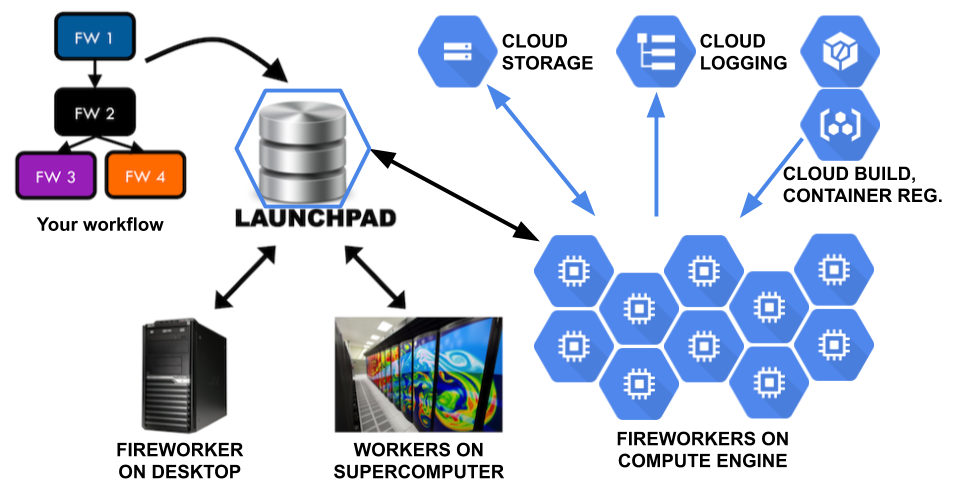

# Borealis

Runs [FireWorks workflows](https://materialsproject.github.io/fireworks/) on
[Google Cloud Platform computing services](https://cloud.google.com/) (GCP).

See the repo [Borealis](https://github.com/CovertLab/borealis) and the
PyPI page [borealis-fireworks](https://pypi.org/project/borealis-fireworks/).


## What is it?

**[FireWorks](https://materialsproject.github.io/fireworks/)** is an open-source
workflow management system, that is, it drives interdependent computing tasks.
Among the many workflow systems available,
FireWorks is exceptionally straightforward, lightweight, and
adaptable. It's well tested and supported. The only shared services it needs are
a MongoDB server (acting as the workflow "LaunchPad") and a file store.

**Borealis** lets you spin up as many temporary worker machines as you want in
the [Google Cloud Platform](https://cloud.google.com/docs/) to run your
workflow. That means pay-per-use and no contention between workflows.


## How does Borealis support workflows on Google Cloud Platform?

**TL;DR:** Spin up worker machines when you need them, deploy your task code to
the workers in Docker Images, and store the data in Google Cloud Storage instead
of NFS.



Figure 1. Blue hexagons represent Google Cloud Platform services.
The LaunchPad is shown in a blue hexagon because it's implemented as a
MongoDB server that you can run on Compute Engine.

**Worker VMs:** As a _cloud computing_ platform, [Google Compute
Engine](https://cloud.google.com/compute/) (GCE) has a vast number of machines
available. You can spin up lots of GCE "instances" (also called Virtual Machines
or VMs) to run your workflow, change your code, re-run some tasks, then let the
workers time out and shut down. Google will charge you based on usage and
there's no resource contention with your teammates.

Borealis provides the `ComputeEngine` class and its command line wrapper `gce`
to create, tweak, and delete groups of worker VMs.

Borealis provides the `fireworker` Python script to run as the top level program
of each worker. It calls FireWorks' `rlaunch` feature.

You can run these Fireworkers on and off GCE as long as they can connect to
your MongoDB server and to the data store for their input and output files.


**Docker:** You need to deploy your payload task code to those GCE VMs. It
might be Python source code and its runtime environment, e.g. Python 3.8,
Python pip packages, Linux apt packages, compiled
Cython code, data files, and environment variable settings. A GCE VM starts up
from a **GCE Disk Image** which _could_ have all that preinstalled (with or
without the Python source code) but it'd be hard to keep it up to date and
hard to keep track of how to reproduce it.

This is what Docker Images are designed for. You maintain a `Dockerfile` containing
instructions to build the Docker Image, then use the **Google Cloud Build**
service to build the Image and store it in the **Google Container Registry**.

Borealis provides the `DockerTask` Firetask to run a task in Docker. It
pulls a named Docker Image, starts up a Docker Container, runs a given shell
command in that Container, and shuts down the Container. Running in a Container
also isolates the task's runtime environment and side effects from the
Fireworker and other tasks.


**Google Cloud Storage:** Although you _can_ set up an NFS shared file service
for the workers' files, **Google Cloud Storage** (GCS) is the native storage
service. GCS costs literally 1/10th as much as NFS service and it scales up
better. GCS lets you archive your files in yet lower cost tiers intended for
infrequent access. Pretty much all of Google's cloud services revolve around GCS,
e.g., Pub/Sub can trigger an action on a particular upload to GCS.

But Cloud Storage is not a file system. It's an _object store_ with a light
weight protocol to fetch/store/list whole files, called "blobs." It does not
support simultaneous writers. Instead, the last "store" of a blob wins. Blob
pathnames can contain `/` characters but GCS doesn't have actual directory objects,
so e.g. there's no way to atomically rename a directory.

`DockerTask` supports Cloud Storage by fetching the task's input files from GCS
and storing its output files to GCS.


**Logging:** `DockerTask` logs the Container's stdout and stderr, and
`fireworker` sets up Python logging to write to Google's
**StackDriver** cloud logging service so you can watch your workers running
in real time.


**Projects:** With Google Cloud Platform, you set up a _project_ for your team
to use. All services, VMs, data, and access controls are scoped by the project.


## How to run a workflow

After doing one-time setup, the steps to run a workflow are:

1. Build a Docker container Image containing your payload tasks to run in
the workflow. The `gcloud builds submit` command will upload your code and a
`Dockerfile`, then trigger a Google Cloud Build server server to build the
Docker Image and store it in the Google Container Registry.

   See [Building Your Docker Image](docs/docker-build.md) for how to build
   the Docker Image, starting with writing the `Dockerfile`.

1. Build your workflow and upload it to MongoDB.
You can do this manually by writing a `.yaml` file and running the `lpad`
command line tool to upload it, or automate it by implementing a _workflow builder_
program which calls FireWorks APIs to construct and upload a `Workflow` object.

   The workflow will run instances of the `DockerTask` Firetask. Of course
it can run other Firetasks as well; they just won't get deployment,
storage, logging, and timeout features from `DockerTask`.

   If you need to open a secure ssh tunnel to the MongoDB server running in
a Google Compute Engine VM, use the `borealis/setup/example_mongo_ssh.sh`
shell script.

1. Start one or more `fireworker` processes to run the workflow tasks.

   There are three ways to do this:

   * Run the `fireworker` process locally (this is handy for
   debugging) by running the `fireworker` Python script.
   * Launch a group of fireworkers on Compute Engine VMs (this is handy for
   getting a lot of work done in parallel) by running the Python script `gce`.
   * Automate the launching of a group of fireworkers on GCE by making your
   workflow builder code call on the Borealis `ComputeEngine` class after it
   builds and uploads the workflow.

1. While it runs and afterwards, you can:

   * watch the [main GCP dashboard](https://console.cloud.google.com/home/dashboard)

     **Tip:** Add VM load charts to this page.

   * watch the [Compute Engine VM Instances](https://console.cloud.google.com/compute/instances)
   console to see your list of workers

   * watch the [Google Cloud Logs Explorer](https://console.cloud.google.com/logs/)
     of your running operations.  
     (Set a Logs query like `resource.labels.instance_id:"fireworker" severity>=INFO` to
     see just the big picture of Fireworkers and Firetasks starting and stopping.
     The `:` means "starts with."  
     Expand the log level to `severity>=DEBUG` to include task stdout and stderr lines.  
     If coworkers are also running workflows, you can filter to just your own
     Fireworkers using a query like
     `resource.labels.instance_id:"fireworker-USER-"`,
     inserting your $USER name.)

   * [open the Fireworks Web GUI](https://materialsproject.github.io/fireworks/basesite_tutorial.html)  
     ```shell script
     lpad webgui
     ````

     **Bug:** If the `lpad webgui` command prints an error  
     `TypeError: cannot pickle '_thread.lock' object`  
     that means you hit a compatibility problem with FireWorks on Python 3.

     **Fix:** Upgrade to `fireworks>=1.9.7`.

     **Workaround:** If you can't update fireworks, then run
     ```shell script
     lpad webgui -s
     ````

     which starts the web server without the web browser, and manually
     open a browser to the web server URL that it prints,
     such as [http://127.0.0.1:5000](http://127.0.0.1:5000).
     (In iTerm, just CMD-click the URL.)

   * [query your Fireworks tasks and Workflows](https://materialsproject.github.io/fireworks/query_tutorial.html)  
     ```shell script
     lpad get_fws
     lpad get_wflows
     lpad report
     ````

   * [rerun Fireworks tasks or Workflows](https://materialsproject.github.io/fireworks/rerun_tutorial.html)  
     ```shell script
     lpad rerun_fws -i <FW_IDS>
     lpad rerun_fws -s FIZZLED
     ````

   * [pause/restart Fireworks tasks or Workflows](https://materialsproject.github.io/fireworks/defuse_tutorial.html)  
     ```shell script
     lpad pause_fws -i <FW_IDS>
     lpad resume_fws -i <FW_IDS>
     lpad defuse_fws -i <FW_IDS>
     lpad reignite_fws -i <FW_IDS>

     lpad pause_wflows -i <FW_IDS>
     lpad defuse_wflows -i <FW_IDS>
     lpad rerun_fws -i <FW_IDS>
     lpad reignite_wflows -i <FW_IDS>
     ````

   * build a new Docker Image containing bug-fixes, then re-run Fireworks tasks.

     If all the fireworkers have exited, run the `gce` command to launch new
   fireworkers.

   * launch additional fireworkers:
     ```shell script
     gce --base <BASE> --count <COUNT> <NAME-PREFIX>
     ````

     Set the BASE number argument or NAME-PREFIX argument so the new VM names won't
     conflict with your already-running VMs.

   * [Archive or delete a workflow](https://materialsproject.github.io/fireworks/defuse_tutorial.html)
   or reset the entire Launchpad database:
     ```shell script
     lpad archive_wflows -i <FW_IDS>

     lpad delete_wflows -i <FW_IDS>

     lpad reset
     ````

1. Access the output files in GCS via the
[gsutil](https://cloud.google.com/storage/docs/gsutil) command line tool, the
[gcsfuse](https://github.com/GoogleCloudPlatform/gcsfuse) file mounting tool, and the
[Storage Browser](https://console.cloud.google.com/storage/browser) in the
[Google Cloud Platform web console](https://console.cloud.google.com/home/dashboard).

   **Tip:** Use `gsutil -m` to transfer multiple files in parallel.
   (If it prints `TypeError: cannot pickle...`,
   configure `gcloud` and `gsutil` to use Python 3.7 per the note in
   [Install the development tools](docs/install-tools.md).)


## More detail on the Borealis components

The Borealis components can be used separately. Together they enable running
FireWorks workflows in Google Cloud.


**gce:**
The `ComputeEngine` class and its command line wrapper `gce`
create, tweak, and delete a group of worker VMs.

After you generate a workflow, call FireWorks' `LaunchPad.add_wf()`
(or run FireWorks' `lpad add` command line tool) to upload it to the
LaunchPad. Then call `ComputeEngine.create()` (or the `gce` command line)
to spin up a group of worker VMs to run that workflow and pass in the
parameters such as the LaunchPad db name and username
(via GCE metadata fields).

`ComputeEngine` and `gce` can also immediately delete a group of worker
VMs or ask them to quit cleanly between Firetasks, although we usually let
fireworkers shut down on their own after an idle timeout.

`ComputeEngine` and `gce` can also set GCE metadata fields on a group of
workers. This is used to implement the `--quit-soon` feature.

After installing the `borealis-fireworks` pip:

```shell script
$ gce -h
usage: gce [-h] [--delete | --set-metadata | --quit-soon] [-d] [-b BASE]
           [-c COUNT] [-f FAMILY] [-l LAUNCHPAD_FILENAME]
           [-m METADATA_KEY=VALUE]... [-o OPTION_KEY=VALUE]...
           NAME-PREFIX

Create, delete, or set metadata on a group of Google Compute Engine VMs, e.g.
workflow workers that start up from a disk image-family. (This code also has
an API for programs to call.)

...
```

Or to run it within the `borealis-fireworks` source code repository:

```shell script
$ python -m borealis.gce -h
```


**fireworker:**
The `fireworker` Python script runs as as the top level program of each worker
node.
`fireworker` reads the worker launch parameters and calls the FireWorks library
to "rapidfire" launch your FireWorks "rockets." It also handles server shutdown.

`fireworker` connects Python logging to Google Cloud's
StackDriver logging so you can watch all your worker machines in real time.

To run `fireworker` on GCE VMs, you'll need to create a GCE Disk Image that
contains Python, the borealis-fireworks pip, and such. See the instructions in
[how-to-install-gce-server.txt](borealis/setup/how-to-install-gce-server.txt).

The `fireworker` command can also run on your local computer for easier
debugging. For that, you'll need to install the `borealis-fireworks` pip and set
up your computer to access the right Google Cloud Project.


```shell script
$ fireworker -h
usage: fireworker.py [-h] [-l LAUNCHPAD_FILENAME] [-s] [--development]

Run as a FireWorks worker node, launching rockets rapidfire. Gets configuration
settings from Google Compute Engine (GCE) metadata attributes when running on
GCE, else from the Launchpad file (see the `-l` option), with fallbacks. The
setup source files are "/Users/jerry/dev/borealis/borealis/setup/*"
...
```


**DockerTask:**
The `DockerTask` Firetask pulls a named Docker Image, starts up a Docker
Container, runs a given shell command in that Container, and stops the container.

Required params:
* task `name` for logging
* Docker `image` to load up into a Container
* shell `command` to run in the Container
* `internal_prefix` input/output base pathname in the Container
* `storage_prefix` input/output base pathname in GCS

Optional params:
* `inputs` input files and directory trees
* `outputs` output files and directory trees
* `timeout` for stopping the shell command, in seconds

Docker always runs a shell command in the Container. If you want to run a
`Firetask` in the Container, include a little Python script to bridge the gap:
Take a Firetask name and a JSON dictionary as command line arguments,
instantiate the Firetask with those arguments, and call the Firetask's
`run_task()` method.

`DockerTask` supports Google Cloud Storage (GCS) by fetching the task's input
files from GCS, mapping them into the Docker Container, running the task, and
storing its output files to GCS. This means you'll need to specify the input
and output paths as `DockerTask` arguments.
(Your workflow builder code could use this path information to compute the
task-to-task interdependencies for FireWorks.)

Each path you specify in DockerTask's `inputs` and `outputs`
denotes a directory tree of files iff it ends with a `/`.

When storing task output files, `DockerTask` creates entries with names ending in
`/` to act as _directory placeholders_ that speed up tree-oriented traversal.
This means you can run
[gcsfuse](https://github.com/GoogleCloudPlatform/gcsfuse) without using the
`--implicit-dirs` flag, resulting in mounted directories that run 10x faster.

`DockerTask` imposes a given timeout on the task running in the Docker
container.

`DockerTask` logs the Container's stdout and stderr to a file and to Python
logging (which `fireworker` connects to **StackDriver**).


## What's next?

See the [Team Setup](docs/team-setup.md) steps and
the [Developer Setup](docs/developer-setup.md) steps.

See [Building Your Docker Image](docs/docker-build.md).

See [Change Log (aka Release Notes)](docs/changes.md).

Also see [Handy Links](docs/handy-links.md).
